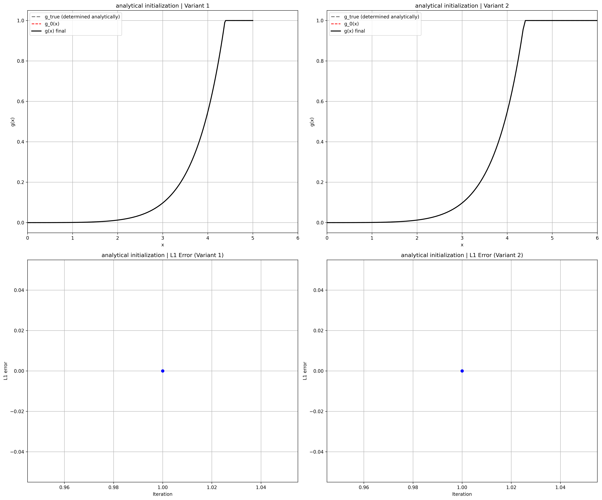
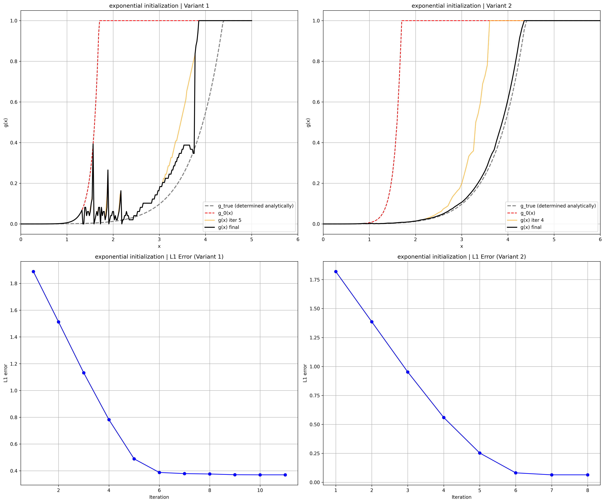
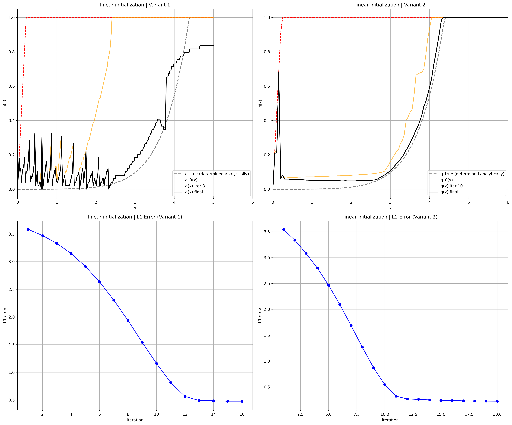
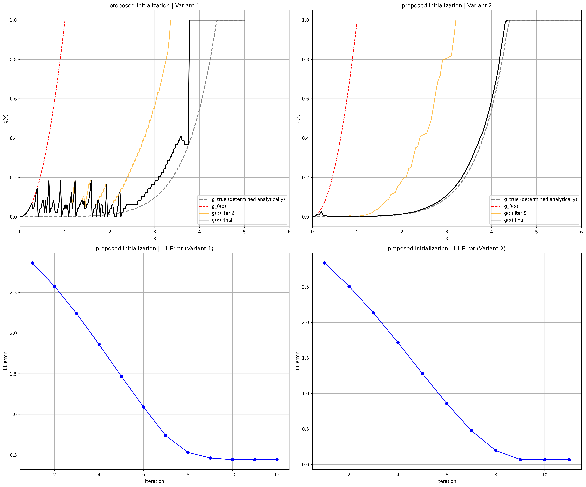
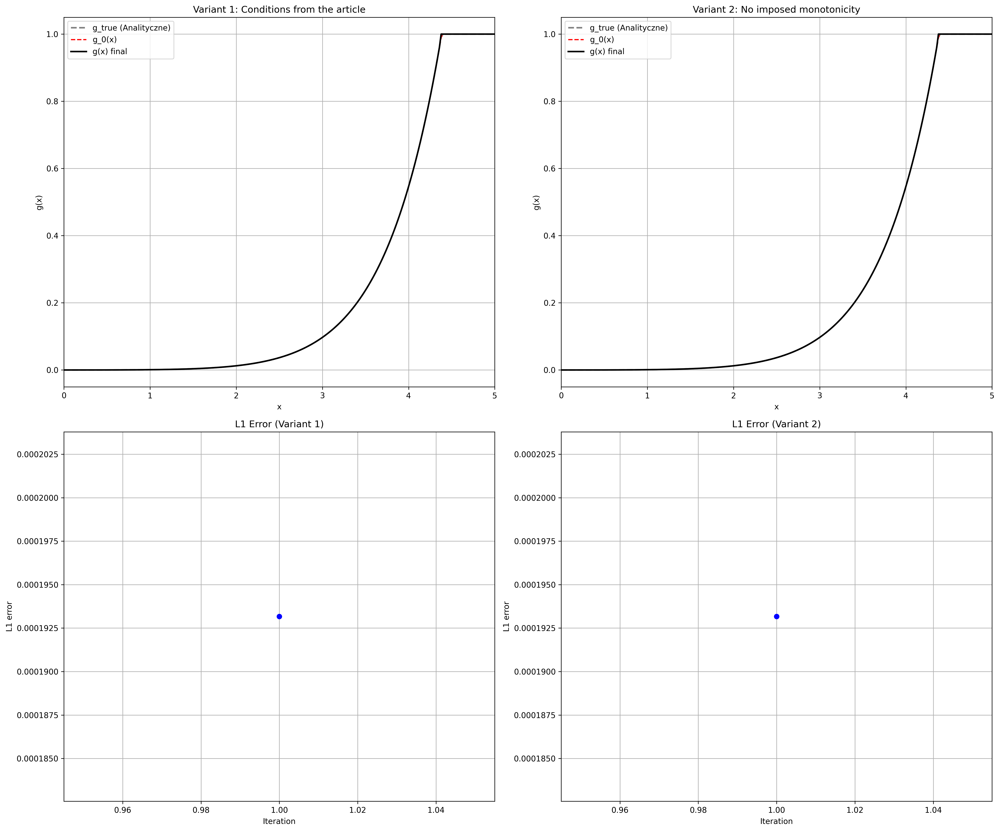
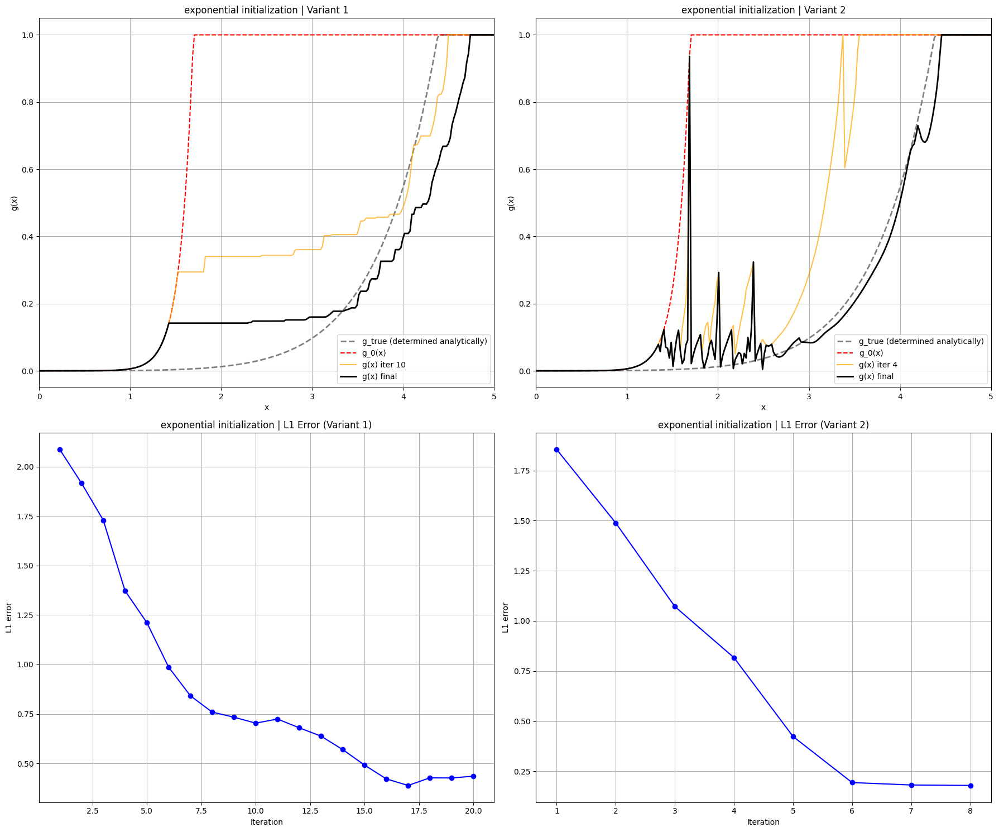
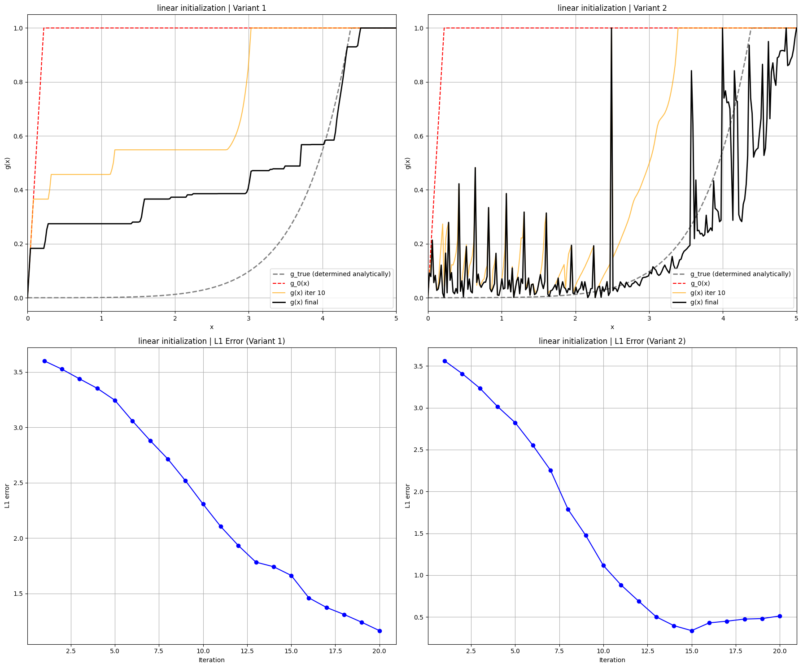

# Results Gallery

Below are the results of the individual algorithms for different grid variants and with different initialization functions.

## Algorithm 1: Model-Based Policy Iteration

<figure markdown="1">
  { width="800" }
  <figcaption>Figure 1.1. Convergence comparison for the analytical initialization function for Variant 1 (coarse grid) and Variant 2 (fine grid).</figcaption>
</figure>

<figure markdown="1">
  { width="800" }
  <figcaption>Figure 1.2. Convergence comparison for the exponential initialization function for Variant 1 (coarse grid) and Variant 2 (fine grid).</figcaption>
</figure>

<figure markdown="1">
  { width="800" }
  <figcaption>Figure 1.3. Convergence comparison for the linear initialization function for Variant 1 (coarse grid) and Variant 2 (fine grid).</figcaption>
</figure>

<figure markdown="1">
  { width="800" }
  <figcaption>Figure 1.4. Convergence comparison for the proposed initialization function for Variant 1 (coarse grid) and Variant 2 (fine grid).</figcaption>
</figure>

## Algorithm 4: Model-Free Policy Iteration

<figure markdown="1">
  { width="800" }
  <figcaption>Figure 2.1. Convergence comparison for the analytical initialization function for Variant 1 (enforced monotonicity), and Variant 2 (no enforced monotonicity).</figcaption>
</figure>

<figure markdown="1">
  { width="800" }
  <figcaption>Figure 2.2. Convergence comparison for the exponential initialization function for Variant 1 (enforced monotonicity), and Variant 2 (no enforced monotonicity).</figcaption>
</figure>

<figure markdown="1">
  { width="800" }
  <figcaption>Figure 2.3. Convergence comparison for the linear initialization function for Variant 1 (enforced monotonicity), and Variant 2 (no enforced monotonicity).</figcaption>
</figure>